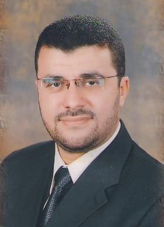

  
<link rel="stylesheet" href="styles.css" type="text/css">  

  

## General Information: {.tabset}  
### Profile  
Name: **Mohamed Mohamed Ezzat Abd El-Monsef.**  
Date of Birth: **1-11-1976, Tanta.**  
Phone: **+2-040-3344352 (Work) - +2-040-3350804(Fax) +2-040-3327551 (Home) - +2-01006765151 (Mobile)**  
E-mail: mmezzat@science.tanta.edu.eg, mme1976@yahoo.com, mme@dr.com  
    
***  

### Current Position:  
- Assistant Professor of Mathematical Statistics, Faculty of Science, Tanta University.  
- Vice manager in Abd El-Monsef Charitable Informative Project (ACIP) for mathematics, statistics & computer science.  
  
***  

### Certificates and Qualifications:  
1. Ph.D, Mathematical Statistics (30 March, 2004), Faculty of Science, Tanta University.  
2. M.Sc, Mathematical Statistics (30 October, 2001), Faculty of Science, Tanta university.  
3. B.Sc, Mathematical	Statistics	(June	1998),	Excellent	grade	(Hones), Faculty of Science, Tanta University.  
  
***  

### Positions Held:  
1. Assistant Professor, Mathematics Department, Faculty of Science, Tanta University (31/5/2016).  
2. Manager of Tanta University Electronic Portal Project (2011-2016).  
3. Lecturer,	Mathematics Department, Faculty of Science, Tanta University (31/5/2004).  
4. Assistant Lecturer, Mathematics Department, Faculty of Science, Tanta University (20/11/2001).  
5. Demonstrator, Mathematics Department, Faculty of Science, Tanta University (10/10/1998).  
***  

### Honors & Awards:  
- Supervision on the best MSc in mathematics - Prof. Bahaa Eldin Helmy Award (2013) from the Egyptian Mathematics Society.  
- Prof. Bahaa Eldin Helmy Award (2005), (the best PhD in mathematics) from the Egyptian Mathematics Society.  
- One of the papers "Generalized Rough Sets" has obtained as oneof the 25 most downloadable papers in Mathematics (2004) according to the Science Direct ranking.  
  
***  

## Training Sessions:
      1.	Special Program in Computer Training for Graduated Students (January 2000).
    2.	Special Program in Internet (April 2000).
    3.	Computer Sessions Level 2 (August 2002).
    4.	Teachers Preparing Session (29 March – 19 April, 2003)
    5.	Intensive English Language Program (17 May – 10 July, 2003).
    6.	Training session on the Internal Quality Systems in the universities, Vaxjo University, Sweden (2005).
    7.	Training session on Preparing the Self-Study for Faculties and Institutes, Bolton University, England (2005).
    
    8.	Training session for Preparing an Electronic Course (2005).
    9.	TOT for the Acting Supervisors in the Faculty and Leadership Development Project (FLDP) (11 December, 2005).
    10.	Attending many workshops on the Quality Control in the Higher Educations (2005-2006).
    11.	Training session for the Acting Supervisors in the Faculty and Leadership Development Project (FLDP) (5-6 August, 2006).
    12.	Course Construction Session (18-19 January, 2006).
    13.	Ethics Profession Session (24-26 January, 2006).
    14.	New Trends in Teaching Session (11-13 February, 2006).
    15.	Thinking Skills Session (14-16 February, 2006).
    16.	Legal Aspects on the Universities Session (7-9 March, 2006).
    17.	Time Control and Labor Pressure Session (11-13 March, 2006).
    18.	Scientific Research Session (21-23 March, 2006).
    19.	TOT about the Roles of the Acting Supervisors in the FLDP (5-6 August 2006).
    20.	Training session on Web-Designing using Dream Waver (2006).
    21.	Training session on Graphics using Adobe Photoshop (2006).
    22.	Training session on Animated Objects using Macromedia Flash (2006).
    23.	Microsoft E-Contents Development Training (2-6 December, 2006).
    24.	Advanced Training session in A+, Advanced Hardcore (2007).
    25.	Building E-Portals using Share-Point (25-27 November, 2007).
    26.	Training session on “Training of Trainers – TOT” (21-25 August, 2016).  

## Teaching:
### Taught Several Statistics (both applied and theoretical), Mathematics and computer courses. The taught courses include:  
- Mathematics: (Math1 – Math2 – Math3 – Abstract Algebra – Advanced Calculus – Analytical Geometry – Calculus – Differential Equations – Linear Algebra – Operations Research – Solid Geometry).  
- Statistics: (Statistics – Analysis of Variance – Biostatistics – Data Analysis – Distributions Theory – Experimental Design – Probability Theory – Queuing Theory – Statistical Inference – Statistical Methods – Statistics for Industry – Math6 – Statistical Programming – Applied Statistics – Engineering Statistics – Regression Analysis – Statistics for Maritime – Statistique en Francais).  
- Computer: (Introduction, Typing, IT, Windows, Dos, Word, Excel, PowerPoint, Access, Front page, Internet, Photoshop, Statistical Application using Excel, SPSS, Minitab, Stata).  

### These courses were offered for under-graduated and post-graduated students at:  
- Faculties   of   Science,   Engineering,	Dentistry,	Education,	Pharmacy, Nursing, and Special Education; Tanta University.  
- Specialized Studies Academy; Tanta and Kafr-El-Sheikh.  
- Faculty of Science; Cairo University.  
- Faculty of Science; Mansoura University.  
- Coventry University – Cardiff Metropolitan University – College of Engineering & Technology – College of Management & Technology – College of Computing & Information Technology – College of International Transport & Logistics – Maritime Safety Institute – Productivity and Quality Institute – International Transport & Logistics Institute; Arab Academy for Science and Technology and Maritime Transport; Alexandria.  

## Professional Experience:
      1.	Manager of Tanta University Electronic Portal Project (2011- 2016)
    2.	Member of the National Committee for Mathematics (2005 - Now)
    3.	Member of the Egyptian Mathematical Society (EMS).
    4.	Member of the Egyptian Rough Sets Group (ERS).
    5.	Member of the Egyptian Statistical Society (ESS).
    6.	Editor secretary of the journal of the Egyptian statistical Society (JESS).
    7.	Member of the Arab Meteors and space sciences Association (AMSSA).
    8.	Certified trainer in the ICTP project.
    9.	Member in the team work for drawing the Quality Assurance Strategic Plan in Tanta University.
    
    10.	Supervising the Statistical Consultation and media in the Quality Management Center, Tanta University (TU-QMC).
    11.	Member of the  teamwork  responsible  for finalizing the self-study of the Faculty of veterinary, Kafr El-Sheikh University.
    12.	Acting supervisor on the sessions in the FLDP and FOEP projects.
    13.	Member of the teamwork responsible for establishing a unified form for the course evaluation, program evaluation and stuff satisfaction questionnaires (funded project from TEMPUS).
    14.	Member of the Quality Assurance Committee, Faculty of Science, Tanta University.
    15.	Member of the teamwork responsible for building and modifying the staff database in Faculty of Science, Tanta University.
    16.	Co-operative work with the Radiation-Analysis group (physics department, Faculty of Science, Tanta University) about the classification of some sand sample taken from El-Zaranik protected zone according to its radiation contents (published paper).
    17.	Co-operative work with the teaching mathematics group (Faculty of Education, Tanta University) for driving new methods for analyzing the educational data using the rough set theory (published paper).
    18.	Co-operative work with the members of the clinical pathology, cancer center for introducing a new method for reducing the clinical tests required to diagnose the type of the tumor (published paper).
    19.	Co-operative work with the members of the pediatrics department, Faculty of Medicine, Tanta University for studying the diagnosis of the rheumatic fever in the children (published paper).  

## Theses Supervision:  
Supervising on 16 M.Sc and 16 Ph.D theses.  

## Statistical Software:  
SPSS – Minitab – Mathematica – MedCalc – R – GraphPad Prism – EasyFit – Lisrel – Stata – Excel.  

## Serving the Community and the Environment:  
1.	Producing educational videos on how to use the computer packages in the statistical applications.
    2.	Delivering lectures on computer science for developing the administrative work in Tanta University.
    3.	Training manager in Abd El-Monsef Charitable Informative Project (ACIP) for mathematics, statistics & computer science.
    4.	Delivering many lectures on biostatistics and participating in training many on how to use the statistical packages in statistical data analysis in the workshops organized by the academy of scientific research, delta development center.
    5.	Training the stuff members and their assistance of the zoology department, Tanta University for using the computer packages in analyzing their biostatistics data (August 2006).
    6.	Training the stuff members and their assistance for using computer, ICT project, Tanta University.
    7.	Training the students of the faculty of economics and political science – Cairo University on using SPSS in Statistical consultations (August 2015).
    8.	Training the staff members of the pharmacology department – Faculty of Medicine – Tanta university on the new trends in analyzing medical data (January – March 2016).
    9.	Training the teaching assistants of the faculty of management and technology – AAST on using SPSS in analyzing questionnaires (January 2018).  

## Scientific Lectures:  
    1.	Analyzing Questionnaires with sympathy, Helwan University (2005).
    2.	Rough Sets theory, the Foundations. The 19th forum on "Topology and its Applications". Faculty of Science, Tanta University; 2 August, 2005.
    3.	Statistical Approach to Rough Sets. The 1st workshop on “Rough Set Theory and its Applications”. Faculty of Science, Alex University; 13 August, 2006
    4.	New Approaches for Analyzing Questionnaires. The 2nd Conference of the Total Quality Management Center, Tanta University (2006).
    5.	Incomplete Information System. The 21st forum on "Topology and its Applications". Faculty of Education, Suez-Canal University; 3 July, 2007.
    6.	Is Rough Sets Really Useful? The 22nd International Conference on Topology and its Applications. Helwan University, 7-8 July, 2008.
    7.	Procrustes Analysis. The 26th conference of topology and its applications. Faculty of Science, Tanta University; 3-4 July, 2012.  

## Conferences and Forums:  
    1.	The 36th Annual Conference of Statistics, Computer Sciences and Operations Research. the Institute of Statistics Studies and Research (ISSR), Cairo University. 22-24 December, 2001.
    2.	A forum for "Problems of Designing and Analyzing the Field Research", Faculty of Science, Tanta University (2001).
    3.	The 15th forum on "Topology and its Applications", Faculty of Science, Tanta University; 15-16 July, 2001.
    4.	A forum "Data Analysis", Faculty of Science, Tanta University (2002).
    5.	The 2nd International Conference of Biological Sciences. Faculty of Science, Tanta University; 27-28 April, 2002.
    6.	A forum on “The Environmental Hazards causing Tumors in Egypt – New Trends”. Faculty of Science, Tanta University; 12 October, 2002.
    7.	1st International Conference of Mathematics, “Trends and developments”. The Egyptian Mathematical Society (EMS), Ain-Shams University; 28-31 December, 2002.
    8.	The 37th Annual Conference of Statistics, Computer Sciences and Operations Research, the Institute of Statistics Studies and Research (ISSR), Cairo University (2002).
    9.	The 18th Medical Conference. Faculty of Medicine, Tanta University; 16-17 April, 2003.
    10.	The 3rd Conference of the Egyptian Educational Mathematics Society. “Teaching and Learning Mathematics and Enovation development”. Ain- Shams University; 8-9 October, 2003.
    11.	The 4th Symposium on Nuclear & Particle Physics held by the Egyptian Society for Nuclear Physics. Fayoum, Cairo University; 11-15 October, 2003.
    12.	The 3rd International Conference of Geophysics. Faculty of Science, Tanta University; 14-16 October, 2003.
    13.	A forum on "Building Egypt Statistically", Faculty of Science, Tanta University (2004).
    14.	A Forum on "Building Models", Faculty of Science, Tanta University, 4 May, 2005.
    15.	A Workshop on “Egyptian-European cooperation in Higher Education”, Tanta University (2005).
    16.	The 19th forum on "Topology and its Applications". Faculty of Science, Tanta University; 2 August, 2005.
    17.	The 6th International Conference on Cooperation and Competition and EU/JEP Project Health Care Quality Management, 22-28 September, 2005.
    18.	A Workshop on “FLDP Acting Supervisor Duties”. Project Management Unit, Tanta University; 11 December, 2005.
    19.	The 2nd Conference of the Total Quality Management Center, Tanta University (2006).
    20.	The 1st one day workshop on “Rough Sets and their Applications”. Faculty of Science, Alex University; 13 August, 2006.
    21.	Final Conference of the Quality Center Project, Tanta University (2006).
    22.	A forum on "Data Reduction Between Statistics and Rough Set Theory", Faculty of Science, Tanta University (2006).
    23.	The 21st forum on "Topology and its Applications". Faculty of Education, Suez- Canal University; 3 July, 2007.
    24.	A workshop “Regional Seminar on Egyptian Portal for Higher Education Institutions (EPHEI)”, Supreme Council of Universities cooperating with UNESCO (2007).
    25.	The Second Workshop on “Rough Set Theory and its Applications in Mathematics & Computer Sciences”, Faculty of Science, Tanta University (2007).
    26.	The 2nd International Conference of Mathematics, the Egyptian Mathematical Society, Ain-Shams University (2007).
    27.	International Conference for enhancing Scientific Research – New Horizons. Tanta University; 20-21 February, 2008.
    28.	The 22nd International Conference on Topology and its Applications. Helwan University; 7-8 July, 2008.
    29.	A Research School on “Recent Developments in the Theory of Elliptic PDE” International Center for Pure and Applied Mathematics (CIMPA) -UNESCO- Egypt, AAST. 26 January – 3 February, 2009.
    30.	A Workshop on “Research Methods & Statistics”, Project Management Unit, Tanta University, 1-3 March, 2009.
    31.	A Workshop on “Diagnostic and therapeutic Approach to different Microbial Pathogens”, Faculty of Medicine, Tanta University, 11-12 March, 2009.
    32.	The 4th Saudi Science Conference “Contributions of Science Faculties to the Development Process”. Tibah University, Al-Madina, KSA; 21-24 March, 2010.
    33.	Egypt-France mathematical conference, Cairo French Cultural Center, Cairo. 3-5 May, 2010.
    34.	The 6th international conference on biological sciences. Faculty of Science, Tanta University; 10-11 November, 2010.
    35.	A forum on "Ethical restrictions of scientific research and its applications in community services". Faculty of Science, Tanta University; 11 April, 2012.
    36.	The 5th Saudi Science Conference “New Vision of the role of Basic Sciences in Development”. Umm Al-Qura University, Makkah, KSA; 16-18 April, 2012.
    37.	The 26th conference of topology and its applications. Faculty of Science, Tanta University; 3-4 July, 2012.
    38.	The 3rd conference for enhancing scientific research (ESR 2012), Tanta University; 18-19 November, 2012.
    39.	The International Conference on Mathematics, “Trends and Development”, the Egyptian Mathematical Society, Ain-Shams University; 27-29 December, 2012.
    40.	The 16th Creative Student Forum, Tanta University, 7-10 September, 2014.
    41.	The 49th Annual Conference of Statistics, Computer Sciences and Operations Research, the Institute of Statistics Studies and Research (ISSR), Cairo University, 22-25 December, 2002.
    42.	The 2nd conference of postgraduate students in science, Faculty of Science, Tanta University, 13-14 October, 2015.
    43.	The 1st forum in Mathematical Statistics, Faculty of Science, Tanta University, 22 September, 2016.
    44.	The 1st international conference of Mathematics, Statistics & Information Technology, Faculty of Science, Tanta University, 20-22 December, 2016.
    45.	The 2nd national conference on Mathematics & its Applications, Guest House, Ain-Shams University, 13-15 May, 2017.
    46.	The 2nd international conference on Mathematics & its Applications (ICMA18), Misr University for Science and Technology, 4-6 April, 2018.  

## Publications  
    1.	Rady, E.A., Fergany, H.A. and Abd El-Monsef, M.M.E. (2001). Exact Test for μ in Some Linear Models. Proc. of the 36th Annual Conference on Statistics, Computer Science and Operations Research. 22-24 December, ISSR, Egypt.
    2.	Rady, E.A., Kozae, A.M. and Abd El-Monsef, M.M.E. (2002). On Rough Probability. Proc. of the 1st International Conference on Mathematics – Trends and developments. 28-31 December, ETMS, Egypt.
    3.	Kozae, A.M. and Abd El-Monsef, M.M.E. (2003). New Trends for Analyzing the Educational Data. Proc. of the 3rd Annual Conference of the Egyptian Educational Mathematics Society. 8-9 October, Ein-Shams University, Egypt.
    4.	Rady, E.A., Fergany, H.A. and Abd El-Monsef, M.M.E. (2003). The Palestinian Problem - Arabian View; Journal of the Egyptian Statistical Society. 19(1), 71-86.
    5.	Abd El-Monsef, M.M.E. Seddeek, M.K., Medhat, T., Kozae, A.M., Sharshar, T. and Badran, H.M. (2003). Classification of Sand Samples According to Radioactivity Content by the Use of Euclidean and Rough Sets Techniques. Proc. of the 4th Annual Conference on Nuclear and Particle Physics. 11-15 October, Fayoum, Egypt.
    6.	Rady, E.A., Kozae, A.M. and Abd El-Monsef, M.M.E. (2004). Generalized Rough Sets. Chaos, Solitons and Fractals. 21, 49-53.
    7.	Kozae, A.M., Abd El-Monsef, M.M.E. and Abd El-Badie, S. (2006). New Approaches for Data Reduction in Generalized Multi-valued Decision Information System: Case Study of Rheumatic Fever Patients. The 1st Workshop on Rough Sets and their Applications. 13 August, Alex University, Egypt.
    8.	Abd El-Monsef, M.M.E. and Kilany, N.M. (2007). Decision Analysis Via Granulation Based on General Binary Relation. International Journal of Mathematics and Mathematical Sciences. doi:10.1155/2007/12714.
    9.	Rady, E.A., Abd El-Monsef, M.M.E. and Abd El-Latif, W.A. (2007). A Modified Rough Set Approach to Incomplete Information Systems. Journal of Applied Mathematics and Decision Sciences. doi:10.1155/2007/58248.
    10.	Abd El-Monsef, M.M.E. and Abd El-Latif, W.A. (2007). New measures on Rough Sets. Proc. of 2nd International Conference on Mathematics: Trends and Developments (ICMTD). 27-30 December, Egypt.
    11.	Abd El-Monsef, M.M.E. and Kilany, N.M. (2007). Modified Probabilistic Rough Set Models. Proc. of 2nd International Conference on Mathematics: Trends and Developments (ICMTD). 27-30 December, Egypt.
    12.	Abd El-Monsef, M.M.E. and Abd El-Badie, S. (2007). A New Approach for data Reduction; 2nd Workshop on Rough Sets and their Applications in Computer Science. 27 February, Tanta University, Egypt.
    13.	Abd El-Monsef, M.M.E. and Abd El-Badie, S. (2008). Data Reduction Relevant Effect of the Breast Cancer Tumor Benignly or Malignancy using RST. Proc. of the 6th International Conference on Informatics and Systems (INFOS). 27-29 March, Cairo University, Egypt.
    14.	Abd El-Monsef, M.M.E. and Kilany, N.M. (2008). Rough Set View on Bayes’ Theorem: Case Study of High Risk Patients for Deep Vein Thrombosis. Journal of the Egyptian Statistical Society (JESS). 24(1), 114-129.
    15.	Abd El-Monsef, M.M.E. and Abd El-Latif, W.A. (2008). Uncertainty Space. Journal of the Egyptian Statistical Society (JESS). 24(1), 130-151.
    16.		Rady, E.A., Abd El-Monsef, M.M.E. and Attia, M.A. (2009). A New Algorithm for Error Contrasts. Journal of the Egyptian Statistical Society (JESS). 25(1), 25-52.
    17.	Rady, E.A., Abd El-Monsef, M.M.E. and Seyam, M.M. (2009). Relationships among Several Optimality Criteria. Interstat. June, #1.
    18.	El-Bassiouny, A.H., Abd El-Monsef, M.M.E. and Saleh, M.A. (2010). Analyzing the Independence in the Information Systems. Journal of the Egyptian Statistical Society (JESS). 26(1), 1-23.
    19.	Abd El-Monsef, M.M.E. and Saleh, M.A. (2010). Rough Discrete Distributions; Journal of the Egyptian Statistical Society (JESS). 26(1), 156-180.
    20.	Abd El-Monsef, M.M.E. and Seyam, M.M. (2011). CDT-Optimum Designs for Model Discrimination, Parameter Estimation and Estimation of a Parametric Function. Journal of Statistical Planning and Inference. 141, 639-643.
    21.		Fergany, H.A., Abd El-Monsef, M.M.E. and Gawdt, O.A. (2011). Continuous Review Inventory Model with Crashing Cost under Service Level Constraint and Probabilistic Fuzzy Numbers. Advanced Modeling and Optimization. 13(1), 13-23.
    22.	Salama, A.S. and Abd El-Monsef, M.M.E. (2011). Generalizations of Rough Set Concepts. Journal of King Saud University (Science). 23, 17-21.
    23.	Salama, A.S. and Abd El-Monsef, M.M.E. (2011). New Topological Approach of Rough Set Generalizations. International Journal of Computer Mathematics. 88(7), 1347-1357.
    24.	El-Bassuony, A.H., Abd El-Monsef, M.M.E., Kilany, N.M. and Ramadan, D.A. (2012). Continuous Longitudinal Data with Nonrandom Intermittent Missing Values; Journal of the Egyptian Statistical Society (JESS). 28(1), 1-28.
    25.	Radwan, N.A., Amin, O.M., Heckmann, R.A. and Abd El-Monsef, M.M.E. (2012). An epidemiological study of Sphaerirostris picae (Acanthocephala: Centrorhynchidae) from Hooded crow (Corvus corone cornix) (Aves: Corvidae) in north Delta of Egypt. Scientia Parasitologica. 13(2), 65-72.
    26.	Rady, E.A., Abd El-Monsef, M.M.E. and Seyam, M.M. (2013). A Review on the Nonparametric Tests. Journal of the Egyptian Statistical Society (JESS). 29(1), 133-176.
    27.	Abd El-Monsef, M.M.E. and Seyam, M.M. (2013). Discriminating Among Several Semiparametric Models. International Journal of Statistics and Probability. 2(3), 96-100.
    28.	Abd El-Monsef, M.M.E. and Seyam, M.M. (2013). Test of symmetry for semiparametric bivariate copula. Interstat, July, #3.
    29.	Abd El-Monsef, M.M.E. and Sohsah, N.M. (2014). Poisson–Weighted Lindley Distribution. Jokull Journal. 64 (5), 192-202.
    30.	Abd El-Monsef, M.M.E. and Elsobky, S.M. (2014). DAT-Optimum Design for Parameter Estimation, Minimizing the Average Variance and Model Discrimination. Jokull Journal. 64 (5), 395-404.
    31.	Abd El-Monsef, M.M.E., Hassanein, W.A. and Kilany, N.M. (2014). A Three- Parameter Weighted Lindley Distribution. Jokull Journal. 65 (6), 263-282.
    32.	Abd El-Monsef, M.M.E. and Ghoneim, S.A. (2015). The Weighted Kumaraswamy Distribution. Information-Tokyo. 18(8), 3289-3300.
    33.	Abd El-Monsef, M.M.E. and Elsobky, S.M. (2015). CDA-Optimum Design for Parameter Estimation, Minimizing the Average Variance and Estimating the Area under the Curve. Journal of Advances in Mathematics. 11(8), 5573-5576.
    34.	Rady, E.A.; Abd El-Monsef, M.M.E. and Sobhy, A.M. (2015). Weibull Semiparametric Regression Models under Random Censorship. Journal of Advances in Mathematics. 11(8), 5577-5582.
    35.	Abd El-Monsef, M.M.E. and Sohsah, N.M. (2016). Poisson–Transmuted Lindley Distribution. Journal of Advances in Mathematics. 11(9), 5631-5638.
    36.	Abd El-Monsef, M.M.E. (2016). A New Lindley Distribution with Location Parameter. Communications in Statistics - Theory and Methods. 45(17), 5204-5219.
    37.	Abd El-Monsef, M.M.E., Hassanein, W.A. and Kilany, N.M. (2017). Erlang- Lindley Distribution. Communications in Statistics - Theory and Methods. 46 (19) 9494-9506.
    38.	Abd El-Monsef, M.M.E. and Elawady, M. M. (2018). Generating a New Flexible Lifetime Class of Distributions on the Latent of Competing Risks and Frailty Models. (Submitted).
    
